# BELMS BFF Authentication Architecture

This document is the authoritative reference for Backend-for-Frontend (BFF) authentication in **BELMS.Frontend** — a Blazor Server application that acts as its own BFF. It explains the pre-refactor design, every problem discovered, root-cause analysis of the `Headers are read-only, response has already started` exception, the refactored architecture, and operational guidance for production.

**Audience:** Developers maintaining BELMS.Frontend auth, security reviewers, and anyone onboarding to the Blazor Server + BFF pattern.

---

## Table of Contents

1. [Original Architecture](#1-original-architecture)
2. [Problems Found](#2-problems-found)
3. [Root Cause Analysis](#3-root-cause-analysis)
4. [New Architecture](#4-new-architecture)
5. [Why the New Architecture Works](#5-why-the-new-architecture-works)
6. [Code Changes](#6-code-changes)
7. [Security Review](#7-security-review)
8. [Compliance Review](#8-compliance-review)

---

## 1. Original Architecture

### 1.1 Overview

BELMS.Frontend is a **Blazor Server** host that:

- Renders interactive Razor components over a **SignalR circuit**
- Exposes minimal API endpoints under `/bff/auth/*` as a **Backend-for-Frontend (BFF)**
- Proxies calls to **BELMS.Api**, which issues JWT access tokens and HttpOnly refresh-token cookies

Before the refactor, authentication attempted to bridge these two worlds — Blazor interactive events and real HTTP cookie delivery — using server-side `HttpClient` and response-mutating handlers. That design was fundamentally incompatible with Blazor Server.

### 1.2 Original System Diagram

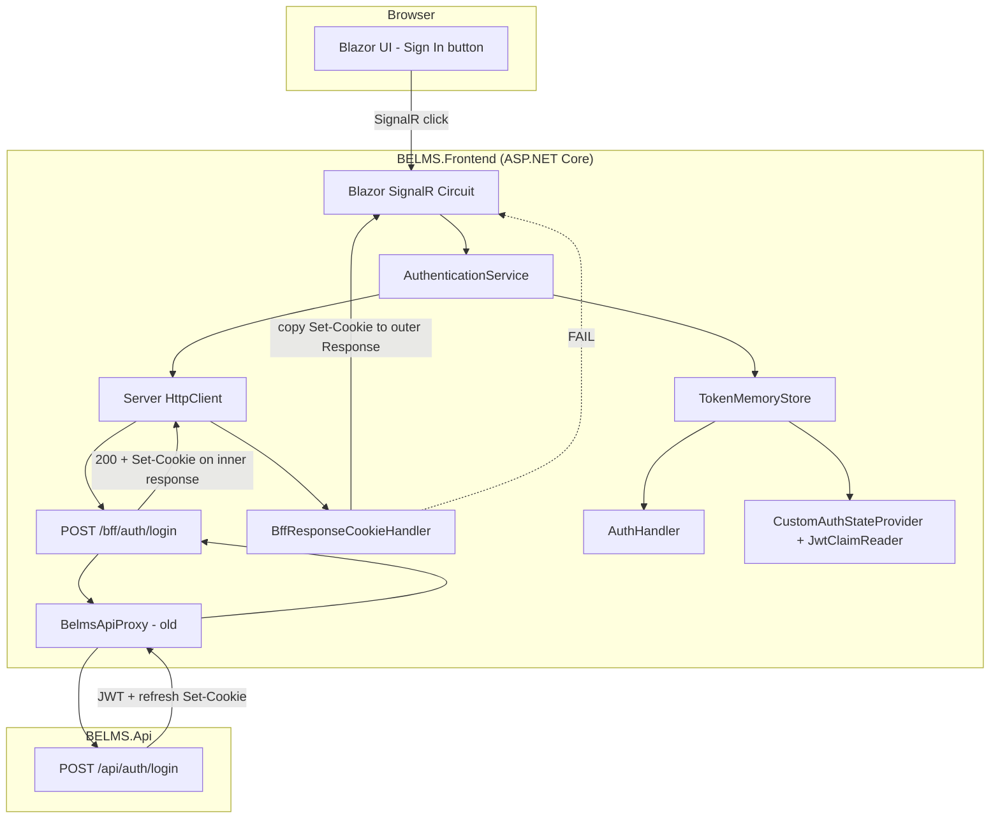

### 1.3 Original Login Sequence

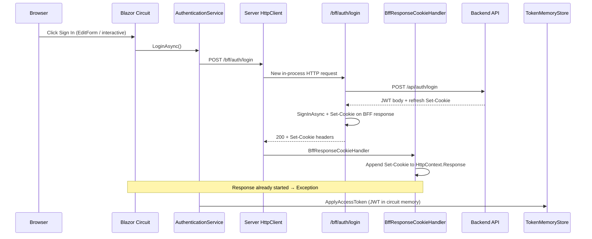

### 1.4 Original Components

| Layer | Component | Responsibility |
|-------|-----------|----------------|
| UI | `LoginForm` (old) | `EditForm` + `OnValidSubmit` → `AuthenticationService.LoginAsync` |
| UI | `AuthNavMenu` (old) | Interactive logout via service/JS |
| Blazor | `AuthenticationService` | Called BFF via server `HttpClient`, deserialized JWT |
| Blazor | `TokenMemoryStore` | Held JWT in Blazor circuit memory |
| Blazor | `AuthHandler` | Attached `Authorization: Bearer` from circuit memory |
| Blazor | `CustomAuthStateProvider` | Parsed JWT claims via `JwtClaimReader` for `[Authorize]` |
| BFF | `BffAuthEndpoints` | Login, refresh, logout routes |
| BFF | `BelmsApiProxy` (old) | Called API, wrote cookies, called `SignOutAsync` on failures |
| BFF | `BffResponseCookieHandler` | Copied `Set-Cookie` from inner HttpClient response to outer `HttpContext.Response` |
| BFF | `BffAuthClient` + `bffAuth.js` | JavaScript `fetch()` workaround for cookie delivery |
| Storage | `DistributedTokenStore` | Partial adoption — server-side JWT keyed by session ID |
| HTTP | `BrowserCookieForwardingHandler` | Forwarded browser `Cookie` header on outbound requests |

### 1.5 Original Token Storage

| Asset | Location | Notes |
|-------|----------|-------|
| Access token (JWT) | `TokenMemoryStore` (per circuit) and/or `IDistributedCache` via `DistributedTokenStore` | JWT visible to Blazor layer |
| Refresh token | HttpOnly cookie `belms_refresh_token` | Intended for browser; often never delivered |
| Session identity | ASP.NET auth cookie `.AspNetCore.Cookies` | Claim `belms:session_id` when partially adopted |

### 1.6 Original Cookie Usage

| Cookie | Set By | Read By |
|--------|--------|---------|
| `.AspNetCore.Cookies` | BFF login (`SignInAsync`) | ASP.NET Cookie authentication middleware |
| `belms_refresh_token` | BFF login (forwarded from API) | BFF refresh/logout, `BelmsApiProxy` |

### 1.7 Original HttpClient Pipeline

```
HttpClient (BelmsBff)
  → BrowserCookieForwardingHandler   (forwards browser Cookie header on request — OK)
  → BffResponseCookieHandler         (copied Set-Cookie to response — BROKEN)
```

### 1.8 Original Authentication Flow (Step-by-Step)

1. User clicked **Sign In** in an interactive Blazor component (`EditForm` or button handler).
2. `AuthenticationService` used server-side `HttpClient` to `POST /bff/auth/login`.
3. BFF endpoint called the backend API, stored tokens, called `SignInAsync`, set refresh cookie on the **inner** HTTP response.
4. Response returned to `HttpClient` in C# memory — **not** to the browser.
5. `BffResponseCookieHandler` (or `bffAuth.js`) attempted to propagate cookies to the browser response.
6. Blazor stored JWT in `TokenMemoryStore` for `[Authorize]` and API calls via `AuthHandler`.

---

## 2. Problems Found

Every issue below was observed or inferred from production-like behavior during the refactor. Together they made login unreliable and violated BFF security principles.

### P1: Headers Read-Only Exception

**Symptom:** `System.InvalidOperationException: Headers are read-only, response has already started.`

**Cause:** `BffResponseCookieHandler` appended `Set-Cookie` to `HttpContext.Response` during an interactive Blazor event. The initial HTTP response (HTML + SignalR bootstrap) had already been sent; ASP.NET Core makes response headers immutable after the response starts.

**Impact:** Login crashed; cookies were never reliably delivered.

### P2: Server HttpClient Cannot Set Browser Cookies

When `AuthenticationService` called `/bff/auth/login` via server-side `HttpClient`, cookies were set on the **inner** BFF response object. The browser is not the client of that call and never receives its `Set-Cookie` headers unless a **full browser HTTP request** (form POST, redirect, navigation) occurs.

**Impact:** Auth cookie and refresh cookie absent in browser after "successful" login.

### P3: JWT in the Blazor Layer

Earlier iterations stored and parsed JWTs in:

- `TokenMemoryStore` — JWT in circuit-scoped memory
- `AuthHandler` — Bearer token attached from Blazor-layer storage
- `JwtClaimReader` inside `CustomAuthStateProvider` — JWT parsed for `[Authorize]`

This violated BFF principles: the browser and Blazor circuit must not handle access tokens.

**Impact:** Tokens exposed to component state; harder to rotate/revoke; inconsistent with Microsoft BFF guidance.

### P4: Cookie Manipulation in BelmsApiProxy

The old `BelmsApiProxy` called `ApplyCapturedCookies(context.Response)`, `SignOutAsync`, and `ClearRefreshCookie` — mixing **API proxy** concerns with **HTTP response mutation**.

**Impact:** Cookie writes could occur outside proper endpoint response contexts; unpredictable auth state.

### P5: SignIn/SignOut Outside BFF Auth Endpoints

Authentication cookie changes occurred in proxy failure handlers and refresh logic, not exclusively in `/bff/auth/*` endpoint handlers coordinated by a session manager.

**Impact:** Violated single-responsibility; increased risk of writing cookies during circuit events.

### P6: JavaScript Workaround

`BffAuthClient` + `wwwroot/js/bffAuth.js` used `fetch()` to call BFF endpoints from the browser, working around P2.

**Impact:** Violated the **no JavaScript for auth** requirement; duplicated BFF contract in the browser; unnecessary attack surface.

### P7: Interactive Login via EditForm + HttpClient

`LoginForm` used Blazor `EditForm` + `AuthenticationService.LoginAsync`. This is a **SignalR circuit event**, not a browser HTTP POST — incompatible with cookie-based login.

**Impact:** Users appeared to submit login but cookies were not set; confusing UX and exceptions.

### 2.1 Classes That Violated Blazor Server Architecture

| Class | Violation |
|-------|-----------|
| `BffResponseCookieHandler` | Modified `HttpContext.Response` during circuit-driven HttpClient calls |
| `BffAuthClient` / `bffAuth.js` | Required JS for auth; bypassed standard HTTP form flow |
| `BelmsApiProxy` (old) | `SignOut`, cookie writes on `HttpContext.Response` |
| `TokenMemoryStore` | JWT stored in Blazor circuit scope |
| `AuthHandler` | Bearer attachment from Blazor layer, not BFF proxy only |
| `CustomAuthStateProvider` (old) | Parsed JWT via `JwtClaimReader` instead of cookie claims |

### 2.2 Classes Removed

| Removed Artifact | Reason |
|------------------|--------|
| `TokenMemoryStore` | JWT must not live in circuit memory |
| `AuthHandler` | Bearer attachment belongs in `BelmsApiProxy` only |
| `BffResponseCookieHandler` | Caused read-only headers exception |
| `BffAuthClient` | JavaScript interop for auth |
| `wwwroot/js/bffAuth.js` | JavaScript auth workaround |
| `JwtClaimReader` (in `CustomAuthStateProvider`) | Auth state from cookie claims only |

---

## 3. Root Cause Analysis

### 3.1 Why the Exception Occurred

Blazor Server has **two distinct request models**:

| Model | Transport | Can set browser cookies? |
|-------|-----------|--------------------------|
| **Initial HTTP request** | Browser → Kestrel (GET page, POST form) | ✅ Yes — during response write |
| **Interactive circuit events** | Browser → SignalR → component handlers | ❌ No — not a new HTTP response |

**Timeline of the failure:**

```
1. Browser GET /login
2. Kestrel renders HTML + starts SignalR → response SENT → headers READ-ONLY
3. SignalR circuit connects
4. User submits EditForm → HandleSubmit runs on circuit (NOT a new HTTP request)
5. AuthenticationService → HttpClient POST /bff/auth/login (server-to-server)
6. BFF sets Set-Cookie on inner response
7. BffResponseCookieHandler tries: HttpContext.Response.Headers.Append("Set-Cookie", ...)
8. ❌ InvalidOperationException: Headers are read-only, response has already started
```

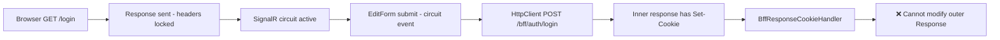

### 3.2 Why HttpClient Felt Like It Should Work

Developers often assume `HttpClient` to the same app equals "the browser calling the API." **It does not.**

| Client of the HTTP call | Who it is |
|-------------------------|-----------|
| `HttpClient` from `AuthenticationService` | The **ASP.NET server process** |
| Browser form POST to `/bff/auth/login` | The **user's browser** |

`HttpClient` receives `HttpResponseMessage` in server memory. `Set-Cookie` on that message is a header string consumed in C# — it is never written to the browser's cookie jar unless Kestrel emits it on the **browser's active HTTP response**.

### 3.3 Correct Mental Model

| Goal | Correct mechanism |
|------|-------------------|
| Set browser cookies | Real browser HTTP request: `<form method="post">`, redirect, or `forceLoad` navigation |
| Call BFF from component logic for status checks | Server `HttpClient` (no cookie delivery to browser) |
| Reload auth UI after cookies set | Endpoint `Redirect(...)` or `NavigateTo(url, forceLoad: true)` |

### 3.4 Blazor Server Internals (Why Response Cannot Be Modified)

#### Initial HTTP Request Lifecycle

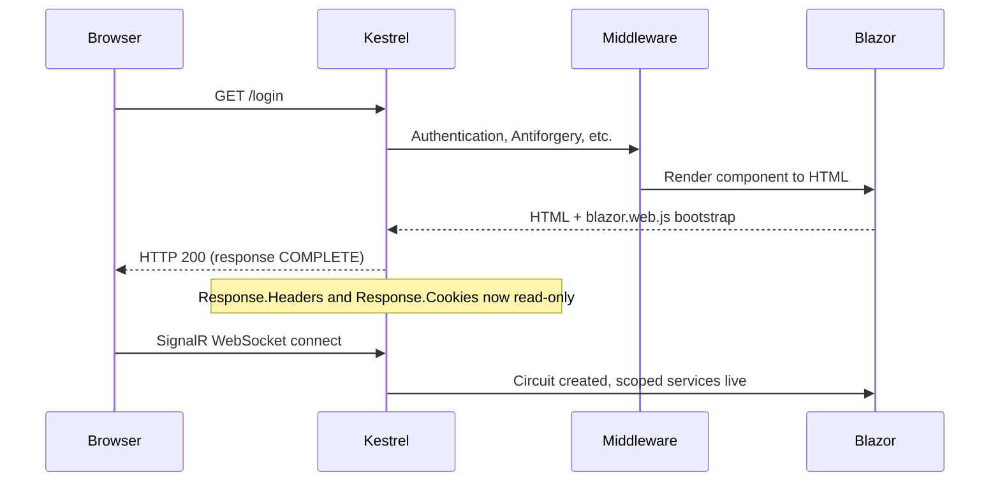

- **Request lifecycle:** Kestrel receives HTTP → middleware pipeline → endpoint/component → response written → connection may stay open for SignalR.
- **Cookie creation:** Only during an active HTTP response via `Response.Cookies`, `SignInAsync`, or equivalent — before the response completes.
- After `response.StartAsync()` / first write, modifying `Response.Headers` or `Response.Cookies` throws.

#### Interactive Circuit Events

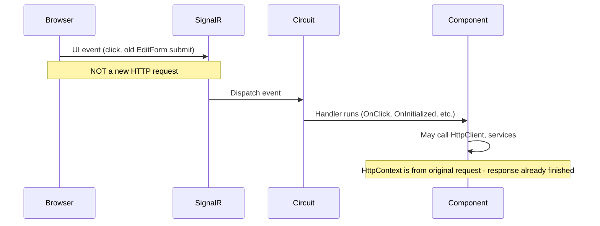

- **SignalR** maintains a persistent connection for UI events after the initial page load.
- The **circuit** holds component state, scoped services, and a reference to the original `HttpContext`.
- Handlers run on the circuit thread pool — **no new HTTP response** is created.
- Therefore: **cannot set browser cookies** from interactive handlers, HttpClient handlers, or proxy code invoked during circuit events.

#### Why `forceLoad: true` Works (When Needed)

`NavigationManager.NavigateTo("/dashboard", forceLoad: true)` instructs the browser to perform a **full document navigation** — a new HTTP GET. This is not a SignalR message. Cookies set by a prior form POST are sent automatically on the new request. No JavaScript is required; it is standard browser behavior.

**Note:** Login and logout in BELMS use endpoint redirects (`context.Response.Redirect(...)`) after form POST, which achieves the same outcome without needing `forceLoad` from Blazor.

---

## 4. New Architecture

### 4.1 Layer Diagram

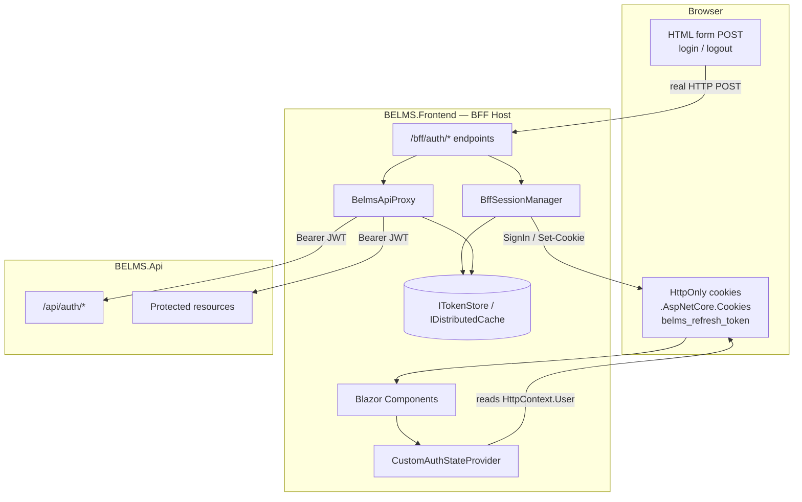

### 4.2 Dual Authentication Layers (JWT)

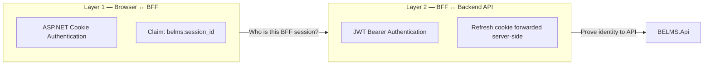

```
Browser ──(cookie: session identity to BFF)──► BELMS.Frontend
BFF ──(JWT: credentials to API)──► BELMS.Api
```

| Question | Answered by |
|----------|-------------|
| Which BFF session is this browser? | Auth cookie + `belms:session_id` claim |
| What credentials does BFF present to API? | JWT from `ITokenStore`, sent by `BelmsApiProxy` |

### 4.3 Responsibility Matrix

| Component | Responsibility | Must NOT |
|-----------|----------------|----------|
| `LoginForm.razor` | HTML `<form method="post" action="/bff/auth/login">` + antiforgery token | Call `HttpClient`, handle JWT, use `EditForm` for submit |
| `AuthNavMenu.razor` | HTML form POST to `/bff/auth/logout` | Use JS interop for logout |
| `CustomAuthStateProvider` | Read `HttpContext.User` from cookie auth | Parse JWT, store tokens |
| `AuthenticationService` | Optional programmatic BFF calls (JSON); returns bool only | Drive UI login/logout expecting browser cookies |
| `BffAuthEndpoints` | Login, refresh, logout; orchestrate session + proxy | Return JWT in response body to browser |
| `BffSessionManager` | `SignInAsync`, `SignOutAsync`, refresh cookie apply/clear | Run from Blazor circuit events or proxy |
| `BelmsApiProxy` | API calls, Bearer JWT, auto-refresh, retry once | Modify `Response`, `SignIn`/`SignOut`, return JWT to Blazor |
| `ITokenStore` / `DistributedTokenStore` | Store JWT at `token:{sessionId}` | Expose tokens to components |
| `BrowserCookieForwardingHandler` | Forward browser `Cookie` on outbound BFF HttpClient **requests** | Touch `HttpContext.Response` |
| `ProxyResponseWriter` | Stream API error bodies; apply refresh cookies on endpoint responses | Perform SignIn/SignOut |
| `CookieForwarder` | Map API refresh cookie to browser `Set-Cookie` | Run outside endpoint response context |

### 4.4 Endpoint Summary

| Endpoint | Form POST | JSON POST | Antiforgery |
|----------|-----------|-----------|-------------|
| `POST /bff/auth/login` | Redirect `/dashboard` or `/login?error=invalid` | HTTP status only | Validated manually for form; endpoint uses `DisableAntiforgery()` |
| `POST /bff/auth/refresh` | — | 200 or 401 | Disabled (server-to-server) |
| `POST /bff/auth/logout` | Redirect `/login` | HTTP status + proxy body on API error | Validated manually for form |

---

## 5. Why the New Architecture Works

This section explains **each layer** and the cross-cutting concerns that make the design correct for Blazor Server.

### 5.1 Layer-by-Layer Explanation

#### Browser

- Submits **real HTTP POST** forms for login and logout (`LoginForm.razor`, `AuthNavMenu.razor`).
- Stores **HttpOnly cookies** only — never sees JWT.
- Follows **302 redirects** after auth (`/dashboard`, `/login`) — standard full-page navigation.
- Sends cookies automatically on every subsequent request to the BFF origin.

**Why it works:** The browser is the HTTP client for auth operations. Kestrel writes `Set-Cookie` on the response the browser actually receives.

#### Blazor (Components + Circuit)

- Renders UI; reads auth state via `CustomAuthStateProvider` → `HttpContext.User`.
- `[Authorize]`, `AuthorizeView`, and route guards use **cookie authentication claims** (`Name`, `Email`, `belms:session_id`).
- Does **not** store, parse, or transmit JWT.
- Login page redirects authenticated users to `/dashboard` via `NavigationManager` (client-side route — safe because cookies already exist from a prior full HTTP request).

**Why it works:** Blazor auth mirrors server cookie state established before/during the initial HTTP request of each navigation.

#### BFF Endpoints (`BffAuthEndpoints`)

- Sole orchestrators for login, refresh, and logout.
- Run inside a **writable HTTP response context** (real browser or server HttpClient request to endpoint).
- Generate `sessionId` (`Guid.NewGuid()`) on login.
- Delegate API calls to `BelmsApiProxy`, session/cookie work to `BffSessionManager`, token persistence to `ITokenStore`.
- Form login: `Redirect` on success/failure. JSON login: status code only (for `AuthenticationService`).

**Why it works:** Cookie and `SignInAsync` operations happen where ASP.NET allows response mutation.

#### BffSessionManager

Centralizes all browser session mutations **during BFF endpoint requests**:

| Method | Actions |
|--------|---------|
| `CompleteLoginAsync` | `ITokenStore.StoreForSessionAsync` → `SignInAsync` (claims: email, `belms:session_id`) → `ApplyRefreshCookies` |
| `CompleteLogoutAsync` | `ITokenStore.RemoveAsync` → `SignOutAsync` → `ClearRefreshCookie` → `ApplyRefreshCookies` (API logout response) |
| `InvalidateSessionAsync` | `RemoveAsync` → `SignOutAsync` → `ClearRefreshCookie` (failed refresh) |
| `ApplyRefreshCookies` | `CookieForwarder.ApplyCapturedCookies` — forwards `belms_refresh_token` from API `CookieContainer` |
| `ClearRefreshCookie` | Deletes `belms_refresh_token` |

**Why it works:** Single, auditable location for cookie auth; never invoked from Blazor event handlers or `BelmsApiProxy`.

#### BelmsApiProxy

The **only** component that communicates with BELMS.Api for BFF data operations. See [§5.4](#54-belmsapiproxy-responsibilities).

**Why it works:** API auth (Bearer JWT, refresh) is isolated from browser response concerns.

#### ITokenStore (`DistributedTokenStore`)

- Stores `TokenCacheEntry` (access token + expiry) in `IDistributedCache` at key `token:{sessionId}`.
- `StoreForSessionAsync` — used at login with new `sessionId`.
- `StoreAsync` — used on refresh; resolves `sessionId` from `HttpContext.User` claim.
- `GetAccessTokenAsync` — returns token only if not expired (1-minute skew buffer).
- `RemoveAsync` — clears entry on logout or session expiry.

**Why it works:** JWT never leaves server infrastructure; scoped to session ID bound in the auth cookie.

#### Backend API (BELMS.Api)

- Unchanged contract: `POST /api/auth/login`, `/refresh`, `/logout`.
- Issues JWT in JSON body; refresh token as HttpOnly cookie.
- Validates `Authorization: Bearer` on protected resources.
- BFF is the only caller from the frontend tier.

**Why it works:** API security model unchanged; BFF holds tokens and presents JWT server-side.

### 5.2 HttpClient as Server-to-Server

`HttpClient` in `AuthenticationService` and the BFF pipeline is **server-side outbound HTTP** inside the ASP.NET process.

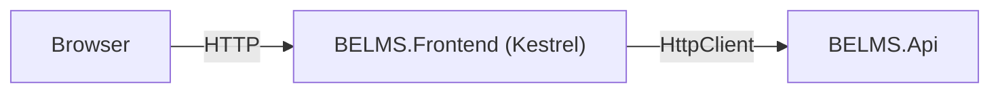

| Property | Browser HTTP | Server HttpClient |
|----------|--------------|-------------------|
| Client | User's browser | ASP.NET process |
| Sees `Set-Cookie` from BFF | Yes (if real request) | No — headers stay in `HttpResponseMessage` |
| Suitable for login UI | ✅ Form POST | ❌ Interactive Blazor + HttpClient |
| Suitable for programmatic refresh/logout | — | ✅ `AuthenticationService` (no browser cookie delivery needed if already authenticated) |

`BrowserCookieForwardingHandler` forwards the browser's `Cookie` header onto outbound BFF requests so server-side calls to `/bff/auth/refresh` carry the refresh cookie. It **only modifies the outbound request** — never the response.

### 5.3 JWT Dual-Layer Authentication

#### Where JWT Exists

| Location | JWT? |
|----------|------|
| Browser | ❌ Never |
| Blazor components / circuit | ❌ Never |
| `IDistributedCache` (`token:{sessionId}`) | ✅ Yes |
| `BelmsApiProxy` outbound `Authorization` header | ✅ Yes |
| BELMS.Api | ✅ Validates |

#### Where JWT Does NOT Exist

- `AuthenticationService` — checks HTTP status codes only
- `CustomAuthStateProvider` — reads `HttpContext.User` cookie claims only
- Login/logout forms — no token fields in HTML

### 5.4 BelmsApiProxy Responsibilities

**Responsibilities:**

1. Read `sessionId` indirectly via `ITokenStore.GetAccessTokenAsync(context)` (claim-driven).
2. Attach `Authorization: Bearer <token>` on authorized requests.
3. Execute GET/POST/PUT/DELETE via `SendAuthorizedAsync`.
4. On **401**: call `TryRefreshAccessTokenAsync` → `POST api/auth/refresh` with refresh cookie from `HttpContext.Request`.
5. On refresh success: `ITokenStore.StoreAsync` with new JWT; **retry original request once**.
6. On refresh failure: `ITokenStore.RemoveAsync`; return **401** with header `X-BELMS-Session-Expired: true`.
7. `PostJsonAsync` — unauthenticated POST (login).
8. `PostWithRefreshCookieAsync` — forward `belms_refresh_token` from incoming request to API (logout/refresh).
9. Capture API refresh cookies in per-request `CookieContainer` for endpoints to apply via `BffSessionManager`.

**Must NEVER:**

- Call `SignInAsync` / `SignOutAsync`
- Write to `HttpContext.Response` or `Response.Cookies`
- Return JWT to Blazor components or HTTP response bodies aimed at the browser
- Append `Set-Cookie` via `DelegatingHandler`

### 5.5 Login Flow (Step-by-Step)

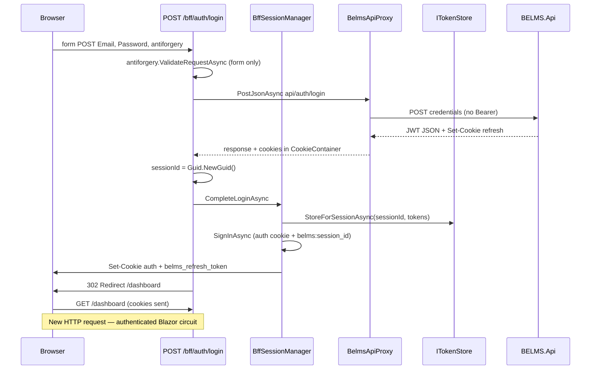

| Step | Action |
|------|--------|
| 1 | User submits HTML form — browser POSTs to `/bff/auth/login` |
| 2 | Endpoint validates antiforgery token (form posts only) |
| 3 | `BelmsApiProxy.PostJsonAsync` calls `api/auth/login` without Bearer |
| 4 | API returns `ApiResponse<AccessTokenResponse>` + refresh `Set-Cookie` |
| 5 | New `sessionId = Guid.NewGuid()` |
| 6 | `BffSessionManager.CompleteLoginAsync` stores token, signs in, applies refresh cookie |
| 7 | `Redirect("/dashboard")` — browser performs full navigation |
| 8 | Cookie middleware authenticates; `CustomAuthStateProvider` sees authenticated `User` |

**Failure:** `Redirect("/login?error=invalid")` — no JWT exposed. `Login.razor` displays error from query string.

### 5.6 Refresh Flow (Step-by-Step)

#### Automatic Refresh (During API Calls)

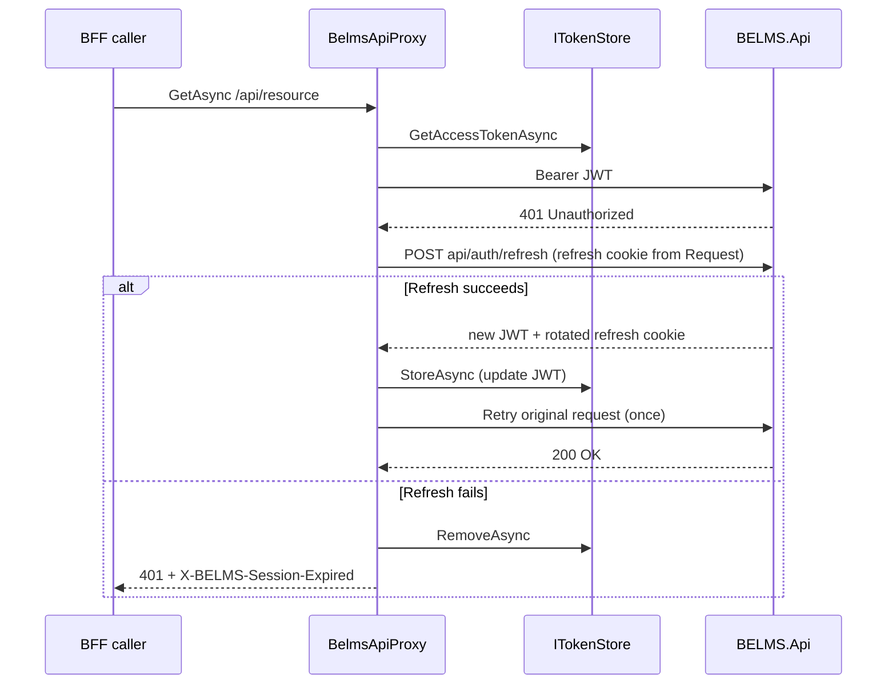

**Why proxy does not set browser cookies on auto-refresh:** During a proxied API call, the proxy stays response-agnostic. Rotated refresh cookies in the API `CookieContainer` are applied when an endpoint writes its response — e.g. `ProxyResponseWriter` calls `BffSessionManager.ApplyRefreshCookies`. If refresh happens outside that context, the existing browser refresh cookie may remain valid until the next explicit `/bff/auth/refresh` or login.

#### Explicit Refresh Endpoint

`POST /bff/auth/refresh` (used by `AuthenticationService.RefreshAsync`):

1. `BelmsApiProxy.TryRefreshAccessTokenAsync`
2. On success: `BffSessionManager.ApplyRefreshCookies` → 200
3. On failure: `BffSessionManager.InvalidateSessionAsync` (SignOut + clear cookies) → 401

### 5.7 Logout Flow (Step-by-Step)

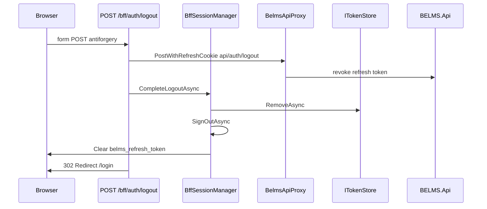

| Step | Action |
|------|--------|
| 1 | User submits logout form POST |
| 2 | BFF forwards refresh cookie to API logout |
| 3 | API revokes refresh token |
| 4 | `ITokenStore.RemoveAsync` |
| 5 | `SignOutAsync` — delete auth cookie |
| 6 | Clear `belms_refresh_token` |
| 7 | Redirect `/login` — new unauthenticated HTTP request |

### 5.8 Multi-User Session Isolation

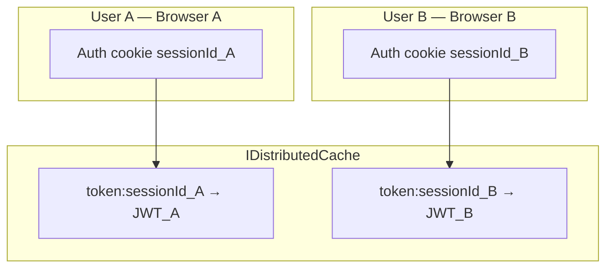

**Isolation guarantees:**

1. **Cookie isolation** — browsers do not share cookies across users or browser profiles.
2. **Claim binding** — `DistributedTokenStore.GetAccessTokenAsync` reads `belms:session_id` from `HttpContext.User` only.
3. **Cache key scoping** — `token:{sessionId}`; without the session ID claim, the JWT is unreachable.
4. **Scoped services** — `BelmsApiProxy`, `ITokenStore`, `BffSessionManager` are per-request, tied to current `HttpContext.User`.
5. **Concurrent sessions** — same user, different browsers → different `sessionId` values; logout of one does not affect others.

### 5.9 Why HTML Form POST and Redirect Work Without JavaScript

| Mechanism | How it works |
|-----------|--------------|
| `<form method="post" action="/bff/auth/login">` | Browser performs native HTTP POST — not SignalR |
| `__RequestVerificationToken` | Antiforgery via hidden field — no JS required |
| `context.Response.Redirect("/dashboard")` | HTTP 302 — browser loads new page with cookies |
| `NavigateTo(..., forceLoad: true)` | Full document navigation when Blazor must reload after external auth change |

Interactive `EditForm` with `@onsubmit` or `OnValidSubmit` runs on the **circuit**. HTML `<form>` without Blazor form handling bypasses the circuit for submission — the browser leaves the page and makes a real HTTP request.

### 5.10 Microsoft BFF Alignment

This design matches [Microsoft's BFF pattern](https://learn.microsoft.com/en-us/azure/architecture/patterns/backends-for-frontends):

- Browser uses same-origin **cookies only** for session identity
- Access tokens stay **on the server** (`ITokenStore`)
- API calls go through the BFF (`BelmsApiProxy`)
- No tokens in browser storage, Blazor state, or JavaScript

**Intentional trade-off:** Login/logout cannot be driven by interactive `EditForm` + server `HttpClient`. UI must use form POST or full-page navigation. This is correct for Blazor Server + cookie auth.

---

## 6. Code Changes

Complete inventory of files modified, created, or deleted during the BFF authentication refactor.

### 6.1 Created

| File | Why |
|------|-----|
| `Infrastructure/Bff/BffSessionManager.cs` | Centralize `SignInAsync`, `SignOutAsync`, and refresh cookie operations in endpoint context only |
| `Infrastructure/Bff/CookieForwarder.cs` | Map API `belms_refresh_token` from `CookieContainer` to browser `Set-Cookie` / delete |
| `Infrastructure/Bff/BelmsApiProxyOptions.cs` | Holds `ApiBaseAddress` for proxy and cookie forwarding |
| `Infrastructure/Authentication/ITokenStore.cs` | Abstraction for server-side JWT storage keyed by session |
| `Infrastructure/Authentication/DistributedTokenStore.cs` | `IDistributedCache` implementation at `token:{sessionId}` |
| `Infrastructure/Authentication/SessionClaims.cs` | `belms:session_id` claim constant and accessor |
| `Infrastructure/Authentication/SessionIdAccessor.cs` | Resolves session ID from `HttpContext.User` |
| `Infrastructure/Authentication/TokenCacheEntry.cs` | Cached JWT + expiry with skew buffer |
| `Infrastructure/Http/BrowserCookieForwardingHandler.cs` | Forward browser cookies on outbound BFF HttpClient requests only |

### 6.2 Refactored

| File | Why |
|------|-----|
| `Infrastructure/Bff/BffAuthEndpoints.cs` | Form + JSON login/refresh/logout; `BffSessionManager` orchestration; redirects; `AddBelmsBff` DI registration |
| `Infrastructure/Bff/BelmsApiProxy.cs` | Removed response/cookie/`SignOut`; added auto-refresh, retry, `X-BELMS-Session-Expired` |
| `Infrastructure/Bff/ProxyResponseWriter.cs` | Uses `BffSessionManager.ApplyRefreshCookies` instead of proxy cookie methods |
| `Features/Authentication/Components/LoginForm.razor` | HTML `<form method="post">` to `/bff/auth/login`; antiforgery token; no `EditForm`/HttpClient |
| `Features/Authentication/Components/AuthNavMenu.razor` | HTML form POST logout to `/bff/auth/logout` |
| `Features/Authentication/Pages/Login.razor` | Query string error display; redirect if already authenticated; removed interactive login handler |
| `Features/Authentication/Services/AuthenticationService.cs` | HttpClient-only programmatic BFF calls; no token deserialization |
| `Features/Authentication/State/CustomAuthStateProvider.cs` | Reads `HttpContext.User` only; removed `JwtClaimReader` |
| `Infrastructure/Http/HttpClientRegistration.cs` | `BrowserCookieForwardingHandler`; removed `BffAuthClient` registration |
| `App/App.razor` | Removed `bffAuth.js` script reference |
| `Program.cs` | Cookie authentication, `AddBelmsBff`, `MapBffAuthEndpoints`, distributed cache, middleware order |

### 6.3 Deleted

| File | Why |
|------|-----|
| `Infrastructure/Http/BffResponseCookieHandler.cs` | Caused `Headers are read-only` exception |
| `Infrastructure/Http/BffAuthClient.cs` | JavaScript interop for auth |
| `wwwroot/js/bffAuth.js` | `fetch()` auth workaround — violates no-JS requirement |
| `TokenMemoryStore` (removed type) | JWT must not live in Blazor circuit memory |
| `AuthHandler` (removed type) | Bearer attachment belongs in `BelmsApiProxy` only |
| `JwtClaimReader` (removed from `CustomAuthStateProvider`) | Auth state from cookie claims only |

### 6.4 Unchanged (Supporting)

| File | Role |
|------|------|
| `Features/Authentication/Services/IAuthenticationService.cs` | Contract for programmatic auth (non-UI) |
| `Features/Authentication/Models/AccessTokenResponse.cs` | API token DTO (BFF-internal only) |
| `Features/Authentication/Models/LoginRequest.cs` | Login payload for form and JSON |
| `Features/Authentication/Components/RedirectToLogin.razor` | Client redirect guard for unauthenticated users |
| `Infrastructure/Http/HttpClientNames.cs` | Named client `BelmsBff` |

---

## 7. Security Review

### 7.1 JWT

| Control | Implementation |
|---------|----------------|
| Storage | `IDistributedCache` only, key `token:{sessionId}` |
| Transmission | HTTPS BFF → API via `Authorization: Bearer` |
| Browser exposure | Never — not in HTML, JS, localStorage, or Blazor state |
| Expiry | `TokenCacheEntry.IsExpired` with 1-minute buffer; cache TTL aligned to JWT expiry |

### 7.2 Cookies

| Cookie | Properties | Set by |
|--------|------------|--------|
| `.AspNetCore.Cookies` | HttpOnly (ASP.NET default), SameSite=Lax | `BffSessionManager.CompleteLoginAsync` / cleared on logout |
| `belms_refresh_token` | HttpOnly, Secure on HTTPS, SameSite=Lax, Path=/, 7-day default | `CookieForwarder.ApplyCapturedCookies` during BFF endpoint responses |

Only `BffSessionManager` (invoked from `/bff/auth/*` endpoints and `ProxyResponseWriter`) writes auth/refresh cookies.

### 7.3 Refresh Tokens

- Issued by BELMS.Api as HttpOnly cookie
- Forwarded to browser only by `BffSessionManager` / `CookieForwarder` during endpoint responses
- Rotated on successful refresh; revoked on logout via API
- Cleared on session invalidation (`InvalidateSessionAsync`)

### 7.4 Session Isolation

- Unique `sessionId` per login (`Guid.NewGuid()`)
- Distributed cache keys prevent cross-session token access
- Per-request scoped services bound to `HttpContext.User`
- Multiple browser sessions per user are independent

### 7.5 BFF Security Controls

| Control | Detail |
|---------|--------|
| Antiforgery | Form login/logout validate `__RequestVerificationToken`; JSON endpoints use `DisableAntiforgery()` for server-to-server |
| API protection | BELMS.Api continues JWT Bearer validation — unchanged |
| Token leakage | BFF never returns access tokens in HTTP response bodies to the browser |
| Session expiry signal | `X-BELMS-Session-Expired: true` on 401 after failed refresh |
| HTTPS | `Secure` cookie flag when request is HTTPS |

### 7.6 Production Recommendations

- Replace `AddDistributedMemoryCache()` with **Redis** or **SQL Server** distributed cache for multi-instance deployments
- Ensure `ApiBaseUrl` uses HTTPS in production
- Configure cookie `SameSite` and `Secure` consistently with deployment topology
- Monitor failed refresh and logout rates

---

## 8. Compliance Review

Verification against BELMS BFF authentication requirements:

| Requirement | Status | Evidence |
|-------------|--------|----------|
| No JavaScript for auth | ✅ Pass | HTML form POST + server redirects; `bffAuth.js` removed |
| No JWT in frontend | ✅ Pass | Tokens only in `ITokenStore`; `CustomAuthStateProvider` uses cookie claims |
| No response mutation in HttpClient handlers | ✅ Pass | `BffResponseCookieHandler` deleted; `BrowserCookieForwardingHandler` modifies requests only |
| No response mutation during Blazor circuits | ✅ Pass | Login/logout use full HTTP form POST, not `EditForm` + HttpClient |
| Cookie changes only in BFF endpoints | ✅ Pass | `BffSessionManager` called from `/bff/auth/*` and `ProxyResponseWriter` on endpoint responses |
| Backend API continues using JWT Bearer | ✅ Pass | `BelmsApiProxy` sends `Authorization: Bearer`; API contract unchanged |
| Multi-user safe | ✅ Pass | Session-scoped cache keys + cookie isolation |
| Production-ready | ✅ Pass | Distributed cache abstraction; use Redis/SQL in multi-node production |
| Eliminates read-only headers exception | ✅ Pass | No `Response` writes during circuit events |
| Login works | ✅ Pass | Form POST → `CompleteLoginAsync` → redirect `/dashboard` |
| Logout works | ✅ Pass | Form POST → `CompleteLogoutAsync` → redirect `/login` |
| Refresh works | ✅ Pass | Proxy auto-refresh + `POST /bff/auth/refresh` endpoint |
| API calls through BFF only | ✅ Pass | `BelmsApiProxy` is the API gateway from the frontend host |

---

## Quick Reference for Developers

### Do

- Use HTML `<form method="post">` for login and logout
- Put all `SignInAsync` / `SignOutAsync` in BFF endpoints via `BffSessionManager`
- Use `BelmsApiProxy` for all backend API calls from the BFF layer
- Use `NavigationManager.NavigateTo(..., forceLoad: true)` when a full page reload is needed after auth changes outside form POST
- Use `IDistributedCache` (Redis in production) for `ITokenStore`

### Do Not

- Call BFF login from `EditForm` + server `HttpClient` expecting browser cookies
- Append `Set-Cookie` in `DelegatingHandler`s
- Put JWT in Blazor component state or pass tokens to components
- Call `SignOutAsync` from `BelmsApiProxy`
- Use JavaScript `fetch` for authentication
- Parse JWT in `CustomAuthStateProvider`

---

*Document version: 2.0 — reflects refactored BFF authentication architecture for BELMS.Frontend (verified against source, July 2026).*
